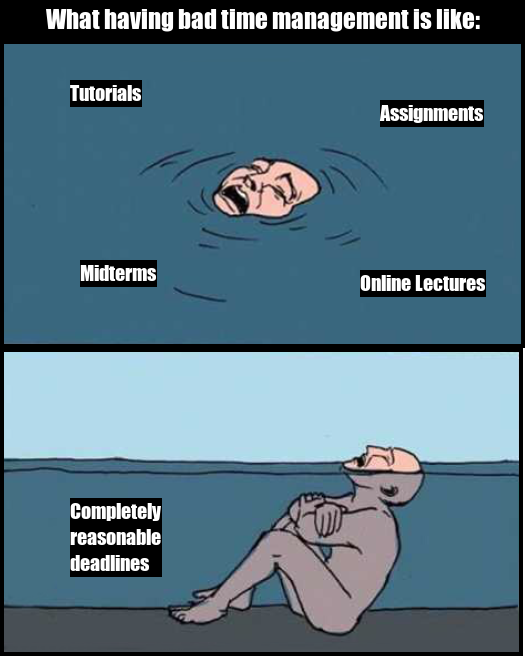

# STATS 220 ASSIGNMENT 1
## My Time Management Issues

## My Motivation Behind the Meme
For the first time in my life, I could say that looking up memes on reddit was for "research purposes". I wanted to create a generally relatable meme that wasn't targeted to a specific group of people. I thought of creating a data science meme, but I just couldn't come up with something genuinely funny or relatable, so I decided to project my *master procrastination skills* onto my meme. After hours of research and debating, this was the result. Although not a difficult meme to create code-wise, I wanted the person looking at the meme to think, "hey, that's so me," or "hey, that's pretty funny." Hopefully I have achieved my goals.

**SOURCE CODE:**
